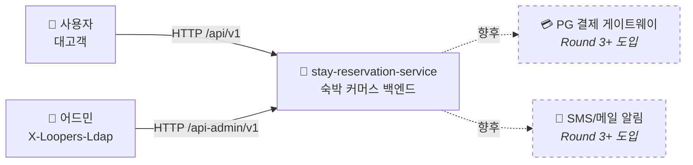
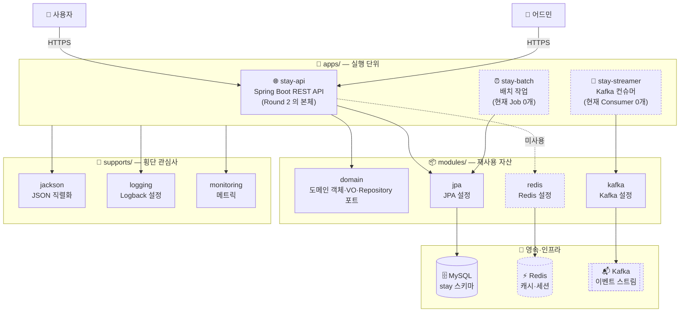

# 00 — Architecture Overview (HLD)

**Status**: `Draft (Round 2)`
**Lifecycle**: `Draft → Review → Approved (Round 2 PR) → Superseded (Round 3+ 결제·외부 시스템 도입 시)`

> **단일 폴더 증강형** — 라운드별 분리 없이 점차 증강 (`docs/design/README.md`).
> 본 문서는 **HLD (High-Level Design) 본체** — *What & Why*. 시스템 컨텍스트 + 컴포넌트 토폴로지 (C4 L1/L2) + NFR + 트레이드오프 종합.
>
> **본 문서의 책임** — 30,000 피트 뷰. 비개발 스테이크홀더도 읽을 수 있어야 함.
> 상세 구현 (LLD) 은 `01-requirements.md` (요구사항 명세), `02-sequence-diagrams.md` (Runtime View), `03-class-diagram.md` (클래스), `04-erd.md` (영속 구조).

---

## 1. 시스템 컨텍스트 (C4 L1)

### 1.1 한 줄 요약

> **stay-reservation-service** 는 사용자가 *도시·날짜·인원* 으로 숙소를 검색·찜·예약·취소할 수 있는 **숙박 커머스** 백엔드. Round 2 시점 본 체계는 *결제·동시성 본격 처리는 후속 라운드* 로 미루고 *기능 동작 + 도메인 모델* 에 집중.

### 1.2 시스템 컨텍스트 다이어그램



### 1.3 액터·외부 시스템

| 대상 | 책임 | 본 라운드 | 비고 |
|---|---|---|---|
| **사용자 (게스트)** | 검색·상세 조회 | ✅ | 비로그인 |
| **사용자 (회원)** | + 찜·예약·취소 | ✅ | 헤더 `X-Loopers-LoginId` 식별 (검증 없음) |
| **어드민** | 숙소·객실·재고/요금·예약 관리 | ✅ | 헤더 `X-Loopers-Ldap: loopers.admin` |
| **PG (외부)** | 결제 처리·환불 | ❌ Round 3+ | idempotency key 패턴 |
| **Notification (외부)** | SMS/메일 발송 | ❌ Round 3+ | 예약 확정·취소·체크인 알림 |

> Round 2 의 *시스템 경계* 는 사실상 *우리 시스템 단독* — 외부 호출 없음. 신뢰 경계·SLO·보안 경계가 매우 단순.

---

## 2. 컴포넌트 토폴로지 (C4 L2 Container View)

### 2.1 다이어그램



### 2.2 컨테이너별 책임

| 컨테이너 | 책임 | 본 라운드 활용도 |
|---|---|---|
| **apps/stay-api** | HTTP REST API 진입점. 대고객 + 어드민 | ✅ Round 2 의 본체 |
| **apps/stay-batch** | Spring Batch — 정산·통계 등 | ⚠️ Round 2 미사용 (Job 0개) |
| **apps/stay-streamer** | Kafka 이벤트 컨슈머 — 외부 이벤트 처리 | ⚠️ Round 2 미사용 (Consumer 0개) |
| **modules/domain** | 도메인 객체·VO·Repository 포트. Spring 무의존 | ✅ User (R1), Property/RoomType/Reservation 등 (R2 진행) |
| **modules/jpa** | JPA 설정·EntityScan·Repository 스캔 | ✅ |
| **modules/redis** | Redis 설정 | ⚠️ R2 미사용 |
| **modules/kafka** | Kafka 설정 | ⚠️ R2 미사용 |
| **supports/jackson** | JSON 직렬화 설정 | ✅ |
| **supports/logging** | Logback 설정 | ✅ |
| **supports/monitoring** | 메트릭 (Actuator 등) | ✅ |

### 2.3 모듈 의존 방향 (단방향)

```
apps/  →  modules/  →  (외부 라이브러리)
   ↓        ↓
   supports/
```

핵심 규칙:
- `apps → modules` 단방향. modules 가 apps 를 참조하지 않음
- modules 끼리는 *원칙적으로 독립* — domain 모듈은 jpa/redis/kafka 모듈과 *무관* (영속 추상화는 포트 인터페이스로)
- supports 는 *횡단 관심사* — apps/modules 양쪽에서 의존 가능

### 2.4 패키지 컨벤션

| 패키지 | 위치 | 의미 |
|---|---|---|
| `com.stay.domain.{aggregate}` | modules/domain | 도메인 객체 (Entity·VO·Aggregate Root) |
| `com.stay.domain.{aggregate}.{Aggregate}Repository` | modules/domain | Repository **포트** (interface) |
| `com.stay.application.{usecase}` | apps/stay-api | Application Service (UserService 등) |
| `com.stay.infrastructure.{aggregate}` | apps/stay-api | Repository 구현체 + JPA Entity 매핑 |
| `com.stay.interfaces.api.v1.{aggregate}` | apps/stay-api | Controller + DTO + ApiSpec |

> 이 컨벤션은 *Round 1 의 modules/domain 분리 결정* (ADR-001) 의 직접 후속. apps 가 *실행 단위*, modules 가 *재사용 자산* 이라는 정의가 *도메인의 자연 위치* 를 결정.

---

## 3. 데이터 흐름 (개요)

### 3.1 Read Path — 검색

```
User
  → GET /properties/search?city=&checkIn=&checkOut=&guests=
  → stay-api (PropertySearchController)
  → PropertySearchService (Application)
  → PropertyRepository.findByCity   ── ① 1차 필터
  → DailyRoomRepository.findByRoomTypeIdsAndDateBetween   ── ② 일자별 일괄
  → 가용성·합산 가격 계산 (Service 책임)
  → 정렬·페이징
  → JSON 응답
```

핵심: **② 일자별 일괄 조회** 로 N+1 회피. 검색은 *fast & approximate* — 실제 예약 시점에 가격·재고 재확인.

### 3.2 Write Path — 예약 생성

```
User
  → POST /reservations { propertyId, roomTypeId, checkIn, checkOut, guestCount, ... }
  → stay-api (ReservationController)
  → ReservationService (Application)

  ▼ @Transactional 시작
  → PropertyRepository.findById (RoomType 포함 로드 — Q3)
  → 도메인 검증 (인원·날짜 등)
  → DailyRoomRepository.findByRoomTypeAndDateBetween (체크인~체크아웃-1)
  → 가용성 검증 + 일자별 차감 (DailyRoom.consumeOne)
  → DailyRoomRepository.saveAll
  → 스냅샷 생성 (정책·가격·이름)
  → Reservation.confirm — 즉시 CONFIRMED (Q1)
  → ReservationRepository.save
  ▲ @Transactional 커밋

  → JSON 응답 (201 Created)
```

핵심: **단일 트랜잭션** — Q1/Q2/Q3 결정의 자연 귀결. 결제 도입 시 *결제 트랜잭션* 으로 확장 필요 (ADR-002 의 향후 재검토).

### 3.3 상세 흐름

각 시퀀스 다이어그램은 `02-sequence-diagrams.md` 참조.

---

## 4. 기술 스택 + 선택 근거

| 영역 | 선택 | 근거 |
|---|---|---|
| **언어** | Kotlin (JVM 21) | 타입 안전성, data class·sealed class, null safety, Java 생태계 호환 |
| **프레임워크** | Spring Boot 3.4.4 | 부트캠프 골격 + JPA·Web·Validation·Actuator 표준 |
| **빌드** | Gradle (Kotlin DSL) 멀티모듈 | apps/modules/supports 경계 강제. 모듈 간 의존 방향 검증 |
| **영속** | JPA (Hibernate) + MySQL 8 | RDB — *(room_type_id, date)* 복합키 + 트랜잭션·ACID 필수 |
| **테스트** | JUnit 5 + Mockito-Kotlin + AssertJ + Testcontainers | TDD 사이클. L1\~L4 4-tier 분류 (rule 17) |
| **암호화** | BCrypt (Spring Security Crypto) | 단방향 해시. Round 1 — Password VO 내부 (ADR-001 부산물) |
| **린터** | ktlint (pre-commit hook) | 코드 일관성 |
| **CI** | GitHub Actions + CodeRabbit | PR 자동 검토 |

### 명시적 *선택하지 않은 것* (Non-choices)

| 선택지 | 거절 이유 |
|---|---|
| ❌ **NoSQL (MongoDB 등)** | 일자별 재고의 `(room_type_id, date)` 복합키 + 트랜잭션 일관성이 RDB 강점 |
| ❌ **Elasticsearch (검색)** | Round 2 검색 부하 미예측. OLTP 직접 쿼리로 시작, 후속 라운드 재검토 |
| ❌ **Redis (캐시)** | Round 2 캐시 도입 비용 > 가치. modules/redis 자리만 유지 |
| ❌ **Kafka (이벤트)** | Round 2 비동기 도메인 없음. modules/kafka 자리만 유지 |
| ❌ **GraphQL** | REST 가 시나리오 API 명세에 자연 부합 |
| ❌ **마이크로서비스 분리** | Round 2 규모에 monolithic + 멀티모듈이 적정 |

---

## 5. NFR (Non-Functional Requirements) 요약

상세는 `01-requirements.md § 8` 참조. 핵심만:

| 항목 | 결정 |
|---|---|
| 시간대 | KST (Asia/Seoul) 고정 |
| 통화 | KRW (정수, 소수점 없음) |
| 날짜 표현 | ISO `yyyy-MM-dd` STRICT 모드 |
| 응답 형식 | `ApiResponse<T>` envelope (Round 1) |
| 페이지 디폴트 | `page=0`, `size=20`, max `size=100` |
| 시점 일관성 | Reservation = *예약 시점 스냅샷* 보관 |
| 응답 한국어 메시지 | `CoreException.message` 통과 |

### 미정의 NFR (의도적)

| NFR | 본 라운드 | 차후 라운드 |
|---|---|---|
| **성능** (P99 응답시간) | 미정 — 학습용 | 부하 테스트 라운드에서 정의 |
| **가용성** (SLA/SLO) | 미정 — 학습용 | 운영 라운드에서 정의 |
| **확장성** (RPS, DAU) | 미정 — 학습용 | 시스템 디자인 라운드에서 정의 |

### 학습 메트릭 (NFR 대체)

`01-requirements.md § 8` 의 *학습 메트릭* — Round 2 Checklist 7항목 + 4 산출물 + 정책 결정 누적 + Skill 5️⃣ 6️⃣ 7️⃣ 충족.

---

## 6. 트레이드오프 종합 (Alternatives Considered)

빅테크 Design Doc 의 핵심 섹션 *Alternatives Considered*. Round 2 의 핵심 결정 3건을 *cross-domain 영향* 으로 종합 (상세는 ADR 참조).

### 6.1 ADR-001 — modules/domain 분리

| 측면 | apps/stay-api 안에 도메인 (기존) | **modules/domain 분리 (채택)** |
|---|---|---|
| 모듈 컨벤션 부합 | ❌ apps = 실행 단위 정의에 어긋남 | ✅ 재사용 자산 정의에 부합 |
| 다른 앱에서 재사용 | ❌ 코드 이동 필요 | ✅ `implementation(project(":modules:domain"))` |
| 도메인 의존성 격리 | ❌ BCrypt dep 가 apps 박힘 | ✅ domain 모듈에 격리 |
| 이동 비용 | 0 | 17 파일 + 빌드설정 + 문서 |

→ Round 1 Cycle 6 시점이 *마지막 저비용 이동 타이밍* 으로 판단 → 채택.

### 6.2 ADR-002 — POST /reservations 즉시 CONFIRMED

| 측면 | A. 즉시 CONFIRMED (채택) | B. PENDING → CONFIRMED 2단계 |
|---|---|---|
| 시나리오 부합 | ✅ 결제 out-of-scope 라 자연 | ⚠️ mock confirm 이 허구의 흐름 |
| 한국 OTA 패턴 | ✅ 야놀자/여기어때 = 결제 즉시 확정 | — |
| 본 라운드 단순성 | ✅ 단일 트랜잭션 | ❌ 2단계 |
| 결제 도입 시 확장 | ⚠️ 결제 트랜잭션 안에 차감 재끼움 | ✅ 자연 |

→ 본 라운드 단순성 우선 + 결제 도입 시 PENDING 재도입은 *부가 확장* 가능 → A 채택.

### 6.3 ADR-003 — 한 테이블 daily_room

| 측면 | A. 한 테이블 daily_room (채택) | B. inventory / rate 분리 |
|---|---|---|
| 어드민 API 부합 | ✅ `{ranges: [{from, to, totalRooms, pricePerNight}]}` 한 묶음 | ⚠️ 2 테이블 분기 |
| 본 라운드 단순성 | ✅ | ❌ |
| 검색 쿼리 단순화 | ✅ 단일 JOIN | ⚠️ 2 JOIN |
| 가격 이력·동시성 영역 분리 | ❌ | ✅ Booking.com 식 |

→ 본 라운드는 *기능 동작* 까지. 가격 이력·동시성 영역 분리가 *실제 요구* 가 되면 마이그레이션.

### 6.4 종합 관찰

세 결정 모두 **"본 라운드 단순성 + 후속 라운드 자연 확장"** 의 공통 트레이드오프 축. *지금 over-engineering 회피, 향후 자연 진화* 가 Round 2 의 일관된 톤.

---

## 7. 외부 의존성 (Round 3+ 도입 자리)

| 외부 시스템 | 도입 시점 | 관계 | SLA/Rate Limit | Fallback |
|---|---|---|---|---|
| **PG (결제)** | Round 3+ | 동기 호출 (idempotency key) | TBD | Saga 보상 트랜잭션 |
| **Notification** | Round 3+ | 비동기 (이벤트 발행) | TBD | DLQ + 재시도 |
| **검색 인덱스** (ES) | 후속 라운드 | 비동기 (CDC + 인덱스 갱신) | TBD | OLTP 폴백 |

상세 표현 컨벤션 → `02-sequence-diagrams.md § 7`.

---

## 8. 위험·미해결 이슈 (Open Questions / Risks)

### 8.1 본 라운드 명시적 보류

| # | 이슈 | 현 상태 | 차후 |
|---|---|---|---|
| Q4 | 더블부킹 동시성 표현 깊이 | 잠정 디폴트 (단일 `@Transactional`) | 시퀀스 그릴 때 재질문 또는 후속 라운드 |
| 부수 결정 1 | RoomType 단건 조회 — Property 경유 vs 별도 Query Repository | 잠정: 변경=Property 경유, 조회=별도 Reader | ERD 작성 시 확정 |
| 부수 결정 2 | 어드민 inventory `{ranges}` 중복 날짜 정책 | 미결정 | 어드민 시퀀스 본격 작성 시 |

### 8.2 일반 리스크 (선택지 형태)

`01-requirements.md § 9` 의 5건 — 더블부킹 / 트랜잭션 비대화 / 검색 성능 / 정책 변경 영향 / PG 일관성.

### 8.3 알려진 환경 이슈

- **Testcontainers ↔ Docker Desktop 29.x** 호환성 — Spring Context 테스트 로컬 실패. `build -x test` 로 컴파일·ktlint 만 검증

---

## 9. ADR 인덱스

본 시점에 영구 기록된 결정들. 상세는 `docs/adr/` 참조.

| ID | 제목 | Status | 날짜 |
|---|---|---|---|
| ADR-001 | modules/domain 분리 | Accepted | Round 1 (2026-05-22) |
| ADR-002 | POST /reservations 즉시 CONFIRMED | Accepted | Round 2 (2026-05-28) |
| ADR-003 | 일자별 재고·요금 한 테이블 `daily_room` | Accepted | Round 2 (2026-05-28) |

> ADR 운영 정책: `docs/adr/README.md`
> 진행 중 의사결정 누적: `docs/round-N/03-questions.md`
> 본 문서 (00-overview) 와 ADR 의 관계: **본 문서 = *현재 상태의 종합*, ADR = *결정 시점의 스냅샷***. 보완재.

---

## 10. HLD/LLD 위치 (산업 매핑)

본 프로젝트의 설계 산출물이 산업 표준 어디에 매핑되는지:

| 우리 파일 | HLD/LLD | C4 zoom | arc42 |
|---|---|---|---|
| **`00-overview.md`** (본 문서) | **HLD 본체** | **L1 Context + L2 Container** | § 3 + § 5 (상위) + § 7 + § 10 |
| `01-requirements.md` | HLD 이전 (입력) | — | § 1 + § 10 |
| `02-sequence-diagrams.md` | HLD↔LLD 경계 | L3\~L4 | § 6 Runtime View |
| `03-class-diagram.md` (예정) | LLD 본체 | L4 Code | § 5 (하위) |
| `04-erd.md` (예정) | LLD | — | § 5 + § 8 |
| `docs/adr/` | ADR | — | § 9 |

상세 리서치 → `docs/round-2/05-hld-lld-research.md`.

---

## 변경 이력

| 날짜 | 변경 | 사유 |
|---|---|---|
| 2026-05-29 | 첫 작성 (Round 2) | 빅테크 HLD/LLD 리서치 결과 적용. HLD 본체 신설 — 시스템 컨텍스트 (C4 L1) + 컴포넌트 토폴로지 (C4 L2) + NFR 요약 + 트레이드오프 종합 + ADR 인덱스 + 외부 의존성 표시 (출처: `docs/round-2/05-hld-lld-research.md`) |
| 2026-05-29 | § 2.2 C4 L2 다이어그램·표에서 jackson 의 위치를 modules → supports 로 정정 | 검수 중 실제 파일 구조 (`supports/jackson`) 와 불일치 발견 |

---

## 참고

- 요구사항·정책 (HLD 이전): `01-requirements.md`
- Runtime View (HLD↔LLD): `02-sequence-diagrams.md`
- 클래스 (LLD): `03-class-diagram.md`
- ERD (LLD): `04-erd.md`
- ADR: `docs/adr/`
- 진행 메모: `docs/round-2/`
- 빅테크 리서치: `docs/round-2/02-bigtech-requirements-research.md`, `04-bigtech-sequence-diagrams-research.md`, `05-hld-lld-research.md`
- 운영 방침: `docs/design/README.md`
