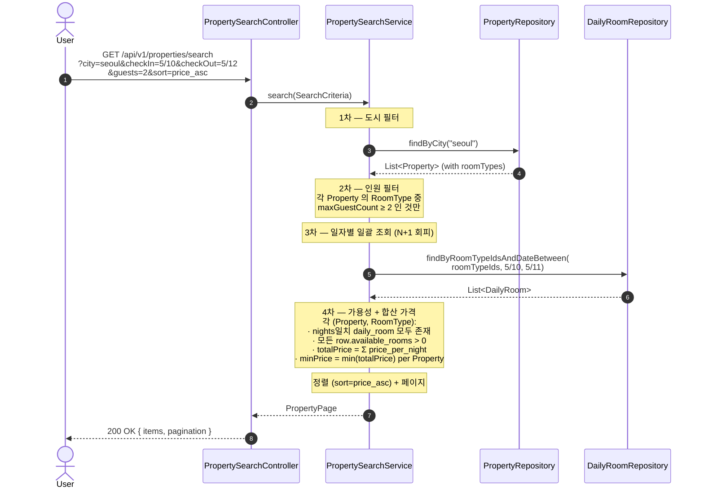
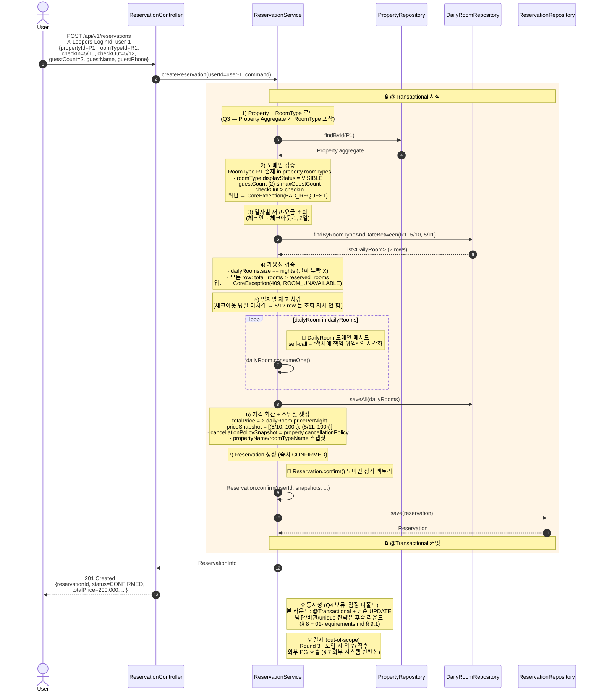
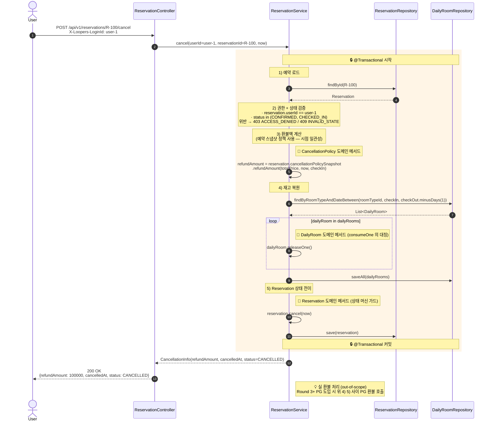
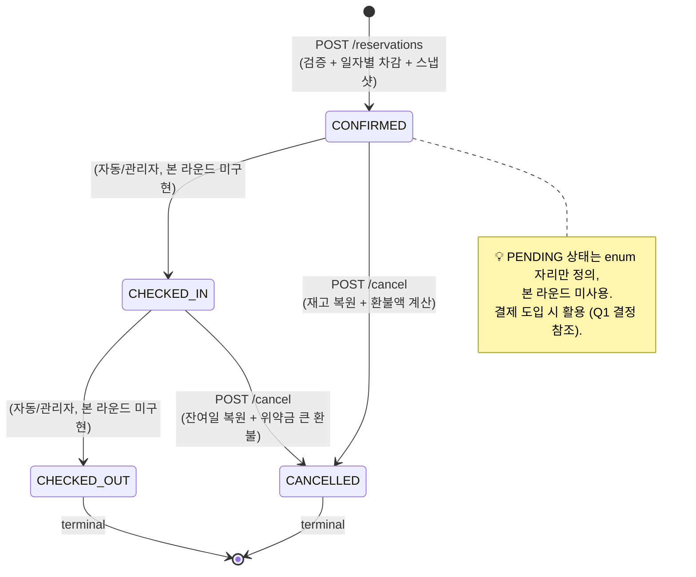
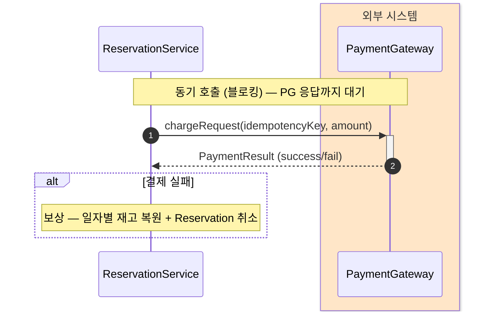

# 02 — Runtime View (시퀀스 + 상태 다이어그램)

**Status**: `Draft (Round 2)`
**Lifecycle**: `Draft → Review → Approved (Round 2 PR) → Superseded (Round 3+ 결제·동시성 도입 시)`

> **단일 폴더 증강형** — 라운드별 분리 없이 점차 증강 (`docs/design/README.md`).
> Skill 5️⃣ 6️⃣ + **arc42 § 6 Runtime View** 구조에 따라 각 다이어그램은 *이유 → 다이어그램 → 해석* 순서.
>
> **본 문서의 책임** — 책임 분리·호출 순서·트랜잭션 경계 (시퀀스) + 객체 생명주기 (상태).
> 도메인 객체 책임은 `03-class-diagram.md`, 영속 구조는 `04-erd.md`.

---

## 명명 — 왜 "Runtime View"

**arc42** (산업 표준 아키텍처 문서 템플릿) 의 § 6 명칭을 따랐다.

- *시퀀스* = 시간 흐름 + 객체 *간* 협업
- *상태* = 한 객체의 *내부* 생명주기

둘 다 *런타임 동적 측면* 으로 한 묶음이 자연 (**Stripe** 의 PaymentIntent 가 두 다이어그램을 *짝* 으로 두는 패턴과 일치).

---

## 운영 방침 — 빅테크 모범 사례 정렬

`docs/round-2/04-bigtech-sequence-diagrams-research.md` 진단 결과 채택한 10개 규칙:

- 한 시나리오 = 한 다이어그램 (참가자 5\~7개 제한)
- 시간 흐름은 위→아래, 첫 발신자(User) 가장 왼쪽
- 트랜잭션 경계는 `rect` 박스 + 🔒 이모지 (Activation bar 보다 분산 시스템에 명료)
- 외부 시스템은 § 7 컨벤션에 따라 색·심볼 분리
- 해피 패스와 에러 흐름은 분리 (alt 우김 ❌)
- **반환 화살표는 *의미 있을 때만*** (단순 통과는 생략 — 잡음 감소)
- 도메인 메서드 self-call 에 🔵 Note 부착 (안티패턴 #3 회피)
- 모든 다이어그램 앞에 *이유*, 뒤에 *해석* (arc42 § 6 + Skill 5️⃣ 6️⃣)

---

## 0. 목차

| # | 다이어그램 | 종류 | 본 라운드 | 비고 |
|---|---|---|---|---|
| 1 | 숙소 검색 (`GET /properties/search`) | 시퀀스 | ✅ | 일자별 일괄 조회·합산 |
| 2 | **예약 생성** (`POST /reservations`) | 시퀀스 | ✅ **핵심** | 일자별 차감·즉시 CONFIRMED |
| 3 | 예약 취소 (`POST /reservations/{id}/cancel`) | 시퀀스 | ✅ | 재고 복원·환불액 계산 |
| 4 | **Reservation 상태 머신** | 상태 | ✅ | Stripe 패턴 — 시퀀스와 짝 |
| 5 | 찜 등록/취소 | 시퀀스 | (자리만) | 후속 증강 |
| 6 | 어드민 일자별 재고 등록 | 시퀀스 | (자리만) | 후속 증강 |
| 7 | 외부 시스템 표현 컨벤션 | 가이드 | ✅ | Round 3+ PG·Notification 도입 시 적용 |
| 8 | 동시성·트랜잭션 표현 정책 (Q4) | 가이드 | ✅ | 잠정 디폴트 |

---

## 1. 숙소 검색 (`GET /properties/search`)

### 1.1 이유

- *체크인\~체크아웃-1* 의 모든 날짜에 대해 *재고 ≥ 1* 인 객실 타입 → **일자별 재고를 N일치 조회·집계** 흐름
- 검색 결과 가격이 *합산 가격* → **일자별 가격 합산** 책임이 어디서 일어나는지 명시
- "사용자가 검색 → 어떤 객체들이 협력하는지" 로 *Service 책임의 자연 크기* 검증

### 1.2 다이어그램

### 1.3 해석

- **3차 일자별 일괄 조회** — Property→RoomType→DailyRoom 을 N+1 로 하면 검색 1건당 수백 쿼리. `roomTypeIds IN (...) AND date BETWEEN ...` 단일 쿼리로 일괄 로드가 핵심
- **합산 가격은 Service 책임** — daily_room 의 *집계* 가 도메인 로직이 아닌 *조회 결과 가공* 이라 Service 위치
- **트랜잭션 경계 없음** — 읽기만. 단, *검색 결과 ≠ 확정 가격* — 실제 예약 시점에 가격·재고 재확인 (산업 표준: "검색은 fast & approximate, 예약은 exact & transactional")

### 1.4 예외·대안 흐름

| 케이스 | 처리 |
|---|---|
| `city` 도시 코드 잘못 | HTTP 400, `INVALID_CITY` |
| `checkOut <= checkIn` | HTTP 400, `INVALID_DATE_RANGE` |
| 결과 0건 | HTTP 200, `items: []` |
| daily_room 누락 일자 | 해당 Property·RoomType 가용 안 함, 결과 제외 |

---

## 2. 예약 생성 (`POST /reservations`) — **핵심**

### 2.1 이유

- 시나리오 핵심: *체크인\~체크아웃 사이 모든 날짜 일자별 재고 차감 + 더블부킹 방지 + 인원수 검증* — 세 가지 책임·순서·트랜잭션 경계
- **Q1 결정 (즉시 CONFIRMED)** 시각화 — 단일 트랜잭션에 검증·차감·CONFIRMED
- *예약 시점 스냅샷* 생성 시점 명시
- Round 2 Checklist 의 *"예약 시퀀스가 모든 일자별 재고 차감 흐름을 다루는가"* 직접 충족

### 2.2 다이어그램

### 2.3 해석

- **단일 트랜잭션** — 검증·차감·INSERT 가 한 `@Transactional`. 부분 실패 시 모두 rollback (AC 시나리오 3 보장)
- **체크아웃 당일 미차감은 *조회 단계에서* 결정** — `dateBetween(checkIn, checkOut.minusDays(1))` 로 5/12 제외. *후처리 제외* 보다 *애초에 안 가져오기* 가 실수 방지
- **자기 호출 (self-call) 은 도메인 메서드 위임의 시각화** — Service 가 직접 `reserved_rooms += 1` ❌ → `DailyRoom.consumeOne()` 으로 책임 위임. 안티패턴 #3 (도메인 로직을 화살표로) 회피용 🔵 Note 부착
- **스냅샷은 도메인 객체 생성 시점에** — Property 정책이 나중에 바뀌어도 *이 예약의 환불액* 은 변하지 않음 (§ 9.4 시점 일관성)
- **동시성은 본 라운드 미구현** — 두 사용자가 같은 (R1, 5/10) 의 마지막 1실에 동시 도달 시 *지금 코드로는* 둘 다 CONFIRMED 될 수 있음

### 2.4 예외·대안 흐름

| 케이스 | 처리 |
|---|---|
| Property/RoomType 미존재 | HTTP 404, `PROPERTY_NOT_FOUND` / `ROOM_TYPE_NOT_FOUND` |
| guestCount > maxGuestCount | HTTP 400, `GUEST_COUNT_EXCEEDED` |
| 일자별 row 누락 (어드민 미등록) | HTTP 409, `INVENTORY_NOT_AVAILABLE` |
| 재고 부족 | HTTP 409, `ROOM_UNAVAILABLE` — 트랜잭션 rollback |
| 잘못된 날짜 범위 | HTTP 400, `INVALID_DATE_RANGE` |
| 헤더 누락 | HTTP 401 |

---

## 3. 예약 취소

### 3.1 이유

- 예약 상태 머신의 *역방향 전이* (CONFIRMED/CHECKED_IN → CANCELLED) 표현
- **재고 복원** — 차감의 *대칭 연산* 책임 위치
- **환불액 계산** — 예약 *스냅샷의 cancellationPolicy* 가 *예약 시점 정책* 임을 시각화
- 본 라운드는 환불액 *계산만*, 실 환불 처리 없음

### 3.2 다이어그램

### 3.3 해석

- **예약 스냅샷 사용** — `reservation.cancellationPolicySnapshot.refundAmount(...)` 가 핵심. 현재 Property 정책이 아니라 *예약 당시 스냅샷* 으로 환불 계산 → 정책 변경되어도 기존 예약 일관 (§ 9.4 방어)
- **재고 복원도 단일 트랜잭션** — 차감과 복원이 *대칭* 패턴 동일
- **환불액은 응답에만** — 본 라운드 PG 미도입이라 *돈은 안 움직임*. PG 도입 시 다이어그램 *4와 5 사이* 에 PG 호출 추가

### 3.4 예외·대안 흐름

| 케이스 | 처리 |
|---|---|
| 예약 미존재 | HTTP 404, `RESERVATION_NOT_FOUND` |
| 타 유저 예약 | HTTP 403, `ACCESS_DENIED` |
| `CHECKED_OUT` 상태 | HTTP 409, `ALREADY_COMPLETED` |
| `CANCELLED` 상태 (재취소) | HTTP 409, `ALREADY_CANCELLED` |
| `CHECKED_IN` 상태 취소 | 허용. 단, 환불액은 정책 따라 0 또는 매우 적음 |

---

## 4. Reservation 상태 다이어그램 — Stripe 패턴

### 4.1 이유

- Reservation 의 *내부 생명주기* 를 시퀀스와 *짝* 으로 시각화 (**Stripe** 의 PaymentIntent 라이프사이클 패턴)
- 시퀀스는 *객체 간 협업*, 상태 다이어그램은 *한 객체의 가능한 모든 전이* — 서로 보완
- `01-requirements.md § 7` 의 ASCII 도식의 *정식 Mermaid 화*
- 상태 전이 가드 (어떤 상태에서 어떤 호출이 가능한가) 를 컴파일 가능한 enum + 도메인 메서드로 직결

### 4.2 다이어그램

### 4.3 해석

- **진입 상태가 CONFIRMED** — Q1 결정 (즉시 CONFIRMED) 의 직접 시각화. PENDING 은 enum 자리만, 본 라운드 미사용
- **두 terminal 상태** (CHECKED_OUT, CANCELLED) — 더 이상 전이 없음. 재취소·재완료 가드 명확
- **CONFIRMED → CHECKED_IN/OUT 전이는 본 라운드 미구현** — 자리만 표시
- **본 상태 머신은 Reservation 도메인 메서드 + enum 가드로 *컴파일 가능* 하게 표현** — `reservation.cancel(now)` 같은 메서드가 *현재 상태가 CONFIRMED/CHECKED_IN 일 때만* 진행

---

## 5. 찜 등록 / 취소 — *자리만*

`POST /api/v1/properties/{id}/wishes`, `DELETE`. 단순 *Property 존재 확인 → wishlist 토글*. 본격 시퀀스는 *증강* 으로 미룸 (Round 2 Checklist 미요구).

핵심 메모:
- 중복 등록 → 멱등 (HTTP 200, 변화 없음)
- 중복 취소 → 멱등
- Property.wishCount 카운터 갱신 시 동시성 — 향후 도입 시 별도 결정

---

## 6. 어드민 일자별 재고/요금 등록 — *자리만*

`PUT /api-admin/v1/rooms/{roomTypeId}/inventory` 의 `{ranges: [...]}` → *일자별 daily_room upsert*. 핵심:
- 각 range 를 일자별로 펼침 (Service 책임)
- `(room_type_id, date)` UNIQUE → 같은 날짜 중복 시 *마지막 입력 우선* 또는 *400 거절* 정책 후속 결정
- 기존 예약된 날짜의 `total_rooms` 를 *현재 reserved_rooms 미만* 으로 줄이려는 시도 → 거절

---

## 7. 외부 시스템 표현 컨벤션

빅테크 모범 사례 (**arc42 + C4 model**): **외부 시스템과 내부 시스템 시각 구분** — 신뢰 경계·SLO·보안 경계가 외부에서 갈리기 때문.

본 라운드는 외부 시스템 사용 없음. **Round 3+ PG·Notification 도입 시** 다음 컨벤션으로 통일:

### 7.1 표기법

- 외부 시스템 — `box` 그룹 + **연한 주황 배경**
- 내부 시스템 — 기존대로 `participant`, 배경 없음
- 외부 호출 — *비동기* 는 `-)` (빈 화살촉), *동기* 는 `->>` (채운 화살촉) + Activation bar (`+`/`-`) 로 *외부 호출 대기 구간* 명시
- 외부 호출 실패 시 보상 — 별도 `alt` 또는 별도 다이어그램

### 7.2 예시 (Round 3+ 적용 예약 결제 시퀀스 발췌)

### 7.3 적용 트리거

- Round 3+ Payment 도메인 도입 시
- Notification (SMS/메일) 외부 호출 도입 시
- 검색 read model 외부 인덱스 (Elasticsearch 등) 도입 시

---

## 8. 동시성·트랜잭션 표현 정책 (Q4 잠정 디폴트)

본 문서의 모든 시퀀스는 **단일 `@Transactional` 경계만** 명시. 동시성 전략 (낙관/비관/unique) 은 `01-requirements.md § 9.1 Risk` 의 선택지로만 정리. 본격 도입은 후속 라운드.

재질문 트리거:
- 사용자가 더 깊은 동시성 표현 (e.g. `@Version` 충돌 alt 분기) 을 원할 때
- 후속 라운드 동시성 본격 도입 시 — 본 시퀀스에 *alt 분기 증강*

---

## 변경 이력

| 날짜 | 변경 | 사유 |
|---|---|---|
| 2026-05-28 | 첫 작성 (Round 2) | 3 핵심 시퀀스 + 찜·어드민 자리 + Q4 잠정 디폴트 |
| 2026-05-29 | "Runtime View" 명명 도입 (arc42 § 6 정렬) / § 4 Reservation 상태 다이어그램 신규 (Stripe 패턴) / § 7 외부 시스템 표현 컨벤션 신규 / 반환 화살표 일부 제거 (잡음 ↓) / 자기 호출에 도메인 메서드 🔵 Note 부착 (안티패턴 #3 회피) | 빅테크 시퀀스 다이어그램 관행 리서치 R1\~R5 적용 (출처: `docs/round-2/04-bigtech-sequence-diagrams-research.md`) |

---

## 참고

- 요구사항·정책: `01-requirements.md` (§ 6 정책, § 7 상태 머신 ASCII, § 9 Risk)
- 클래스 다이어그램: `03-class-diagram.md` (다음 산출물)
- ERD: `04-erd.md`
- 빅테크 리서치 (요구사항): `docs/round-2/02-bigtech-requirements-research.md`
- **빅테크 리서치 (시퀀스 다이어그램)**: `docs/round-2/04-bigtech-sequence-diagrams-research.md`
- 진행 정책: `docs/design/README.md`
- Skill: `.claude/skills/requirements-analysis/SKILL.md` (5️⃣ 6️⃣ 7️⃣)
