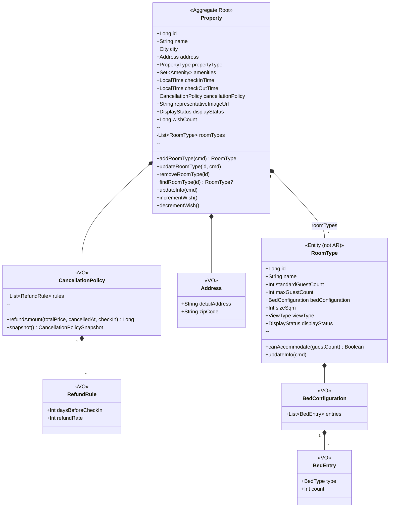
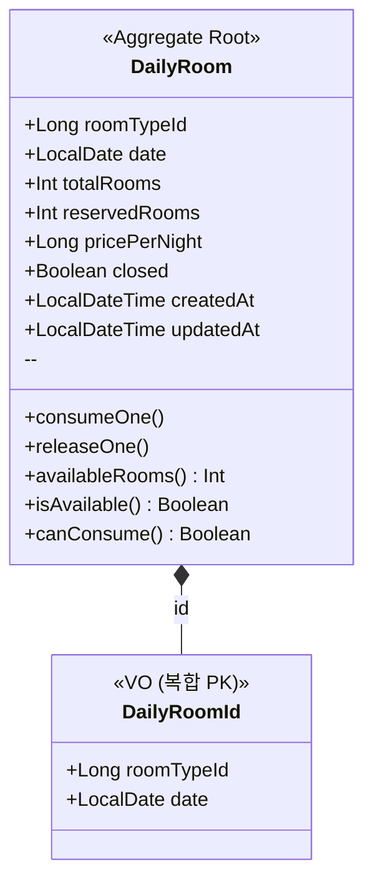
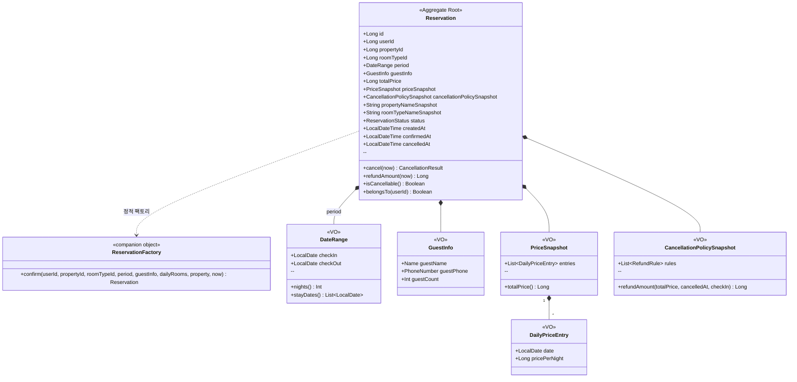
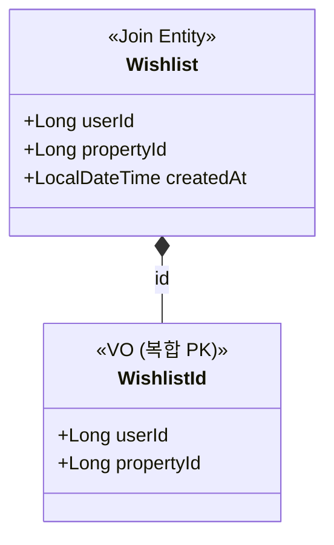
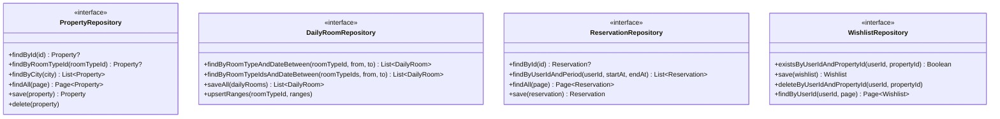

# 03 — Class Diagram (LLD)

**Status**: `Draft (Round 2)`
**Lifecycle**: `Draft → Review → Approved (Round 2 PR) → Superseded (Round 3+ 결제·이벤트 도입 시)`

> **단일 폴더 증강형** — 라운드별 분리 없이 점차 증강 (`docs/design/README.md`).
> 본 문서는 **LLD 본체** 의 한 축 — *클래스의 책임·의존 방향·응집도* 검증. 시퀀스 다이어그램과 *짝* 으로 운영 (Stripe PaymentIntent 패턴).
>
> **본 문서의 책임** — Aggregate 별 도메인 객체 + VO + Repository 포트의 *책임·의존*.
> 영속 구조 (테이블·인덱스·복합키) 는 `04-erd.md`, 객체 협업 (호출 순서) 은 `02-sequence-diagrams.md`.

---

## 운영 방침 — 빅테크 모범 사례 정렬

`02-sequence-diagrams.md` 와 동일한 *arc42 § 5 Building Block View* 흐름 + 클래스 다이어그램 특유 규칙:

- 한 다이어그램 = 한 Aggregate (참가자 5\~10개 제한)
- *Aggregate 간* 참조는 **ID 참조만** (객체 참조 X — Aggregate boundary 원칙)
- *Aggregate 내부* Entity 는 composition (`*--`)
- VO 는 stereotype `<<VO>>` 명시
- 메서드는 *핵심 도메인 메서드만* (getter/setter, equals/hashCode 같은 보일러 생략)
- 모든 다이어그램 앞 *이유*, 뒤 *해석* (Skill 5️⃣ 6️⃣ + arc42 § 6 구조)

---

## 0. 목차

| # | 섹션 | 종류 | 비고 |
|---|---|---|---|
| 1 | 도메인 지도 (전체 Aggregate 한눈에) | 클래스 (간략) | 4 Aggregate + User (R1) |
| 2 | **Property Aggregate** | 클래스 (상세) | RoomType 포함 (Q3 / ADR-001 부수) |
| 3 | **DailyRoom Aggregate** | 클래스 (상세) | 단일 Entity (Q2 / ADR-003) |
| 4 | **Reservation Aggregate** | 클래스 (상세) | 스냅샷 VO 묶음 (C3) |
| 5 | Wishlist (단순 조인 엔티티) | 클래스 | C4 결정 |
| 6 | Repository 포트 (`modules/domain`) | 인터페이스 | C2 결정 — `PropertyRepository` 단일 |
| 7 | 공통 enum / VO | 정의 | City, Amenity, ReservationStatus 등 |

---

## 1. 도메인 지도 — 전체 Aggregate 한눈에

### 1.1 이유

본격 Aggregate 별 클래스 다이어그램 진입 전, *Aggregate 경계* 와 *Aggregate 간 참조 방식* (ID 참조) 을 한눈에. DDD 의 핵심 규율 — *Aggregate boundary 안에서만 객체 참조, 밖은 ID*.

### 1.2 다이어그램

```mermaid
classDiagram
    class User {
        <<Aggregate Root (R1)>>
        Long id
    }

    class Property {
        <<Aggregate Root>>
        Long id
        --
        roomTypes 포함
    }

    class DailyRoom {
        <<Aggregate Root>>
        Long roomTypeId
        LocalDate date
    }

    class Reservation {
        <<Aggregate Root>>
        Long id
        --
        스냅샷 보관
    }

    class Wishlist {
        <<Join Entity>>
        (userId, propertyId) PK
    }

    User "1" --> "*" Wishlist : userId
    Property "1" --> "*" Wishlist : propertyId 참조
    User "1" --> "*" Reservation : userId
    Property "1" --> "*" Reservation : propertyId 참조 (스냅샷)
    Property "1" --> "*" DailyRoom : roomTypeId 경유 (논리적)
    Reservation ..> DailyRoom : 차감 (직접 FK 없음, 카운터)
```

### 1.3 해석

- **5개 Aggregate Root** (User 는 Round 1 완성) — 각자 독립 Repository
- **Aggregate 간 참조는 모두 *ID*** — 화살표 라벨에 *"propertyId 참조"* 처럼 명시. Reservation 은 propertyId·roomTypeId·userId 만 보관, 객체 자체는 보관 X
- **Reservation ─..→ DailyRoom 점선** — *논리적 차감 관계* 이지만 직접 FK 없음. `daily_room.reserved_rooms` 카운터로만 표현 (ADR-003 의 trade-off)
- **Property → DailyRoom 도 점선** — Property 가 DailyRoom 을 *소유* 하지 않음. 둘 다 독립 Aggregate. 연결은 `room_type_id` 만

---

## 2. Property Aggregate

### 2.1 이유

- Q3 결정 — Property Aggregate 가 **RoomType 까지 포함**. PropertyRepository 단일 (C2 결정 — CQRS 도입 X)
- 어드민 RoomType CRUD 는 *모두 Property 경유* — 일관성 단순
- 시나리오의 "숙소 삭제 시 RoomType cascade" 자연 표현 (composition `*--`)

### 2.2 다이어그램



### 2.3 해석

- **`Property` 가 유일한 Aggregate Root** — `RoomType` 은 *내부 Entity* (ID 는 있지만 AR 아님). `List<RoomType>` 컬렉션이 *composition* (`*--`)
- **변경 메서드가 모두 Property 에** — `addRoomType / updateRoomType / removeRoomType / findRoomType`. 외부에서 RoomType 을 *직접 수정* 못 함
- **불변식 보장 자리** — `addRoomType` 안에서 *"같은 이름 RoomType 중복 금지"* 같은 호텔 단위 불변식 검증
- **`wishCount` 카운터 캐시** — 검색 정렬 `wishes_desc` 용. 찜 등록·취소 시 increment/decrement. *동시성은 후속 라운드* (Q4)
- **`CancellationPolicy` 는 VO** — Property 안 embedded. *현재 정책*. 예약 시 `snapshot()` 호출로 `CancellationPolicySnapshot` 생성 (§ 4)

### 2.4 책임 분리 — Service vs Aggregate

| 책임 | 위치 |
|---|---|
| 호텔 단위 불변식 (RoomType 중복 금지 등) | `Property.addRoomType` 안 |
| 외부 데이터 조회 (어드민 명령) | `PropertyService.addRoomType` (apps/stay-api) |
| 트랜잭션 경계 | `PropertyService` 의 `@Transactional` |
| RoomType 수용 인원 검증 | `RoomType.canAccommodate(guestCount)` |

→ Service 는 *얇음* (Repository 호출 + 도메인 메서드 위임 + DTO 매핑). 도메인 로직은 *모두 Aggregate 안*.

---

## 3. DailyRoom Aggregate

### 3.1 이유

- ADR-003 결정 — *일자별 재고·요금 한 테이블*. 도메인 객체도 단일 Aggregate
- Property/RoomType 과 **별도 Aggregate** — 변경 빈도 극단적 차이 (예약마다 변경) → 묶이면 Property 성능 부담
- `consumeOne()` / `releaseOne()` 같은 *도메인 메서드 위임* 위치 명시 (시퀀스 다이어그램의 `🔵 도메인 메서드` Note 와 직결)

### 3.2 다이어그램



### 3.3 해석

- **복합 자연키 `(roomTypeId, date)`** — JPA `@EmbeddedId` 또는 `@IdClass`. 모델 단순 + 의도 명시 (산업 표준)
- **`consumeOne()` / `releaseOne()`** — 도메인 메서드. Service 가 `dailyRoom.reservedRooms += 1` 직접 ❌ → `dailyRoom.consumeOne()` 위임 (안티패턴 #3 회피)
- **불변식** — `consumeOne()` 안에서 `reservedRooms < totalRooms` 검증, 실패 시 `CoreException(409, ROOM_UNAVAILABLE)`
- **`availableRooms()` 파생** — `totalRooms - reservedRooms`. 컬럼 X (도메인 객체에서만 계산)
- **roomTypeId 는 ID 참조만** — Property/RoomType 객체 자체는 모름 (Aggregate boundary)

### 3.4 도메인 메서드 시그니처 — 핵심

```kotlin
class DailyRoom(
    val roomTypeId: Long,
    val date: LocalDate,
    val totalRooms: Int,
    var reservedRooms: Int,
    val pricePerNight: Long,
    val closed: Boolean = false,
) {
    fun consumeOne() {
        if (closed) throw CoreException(ErrorType.CONFLICT, "휴실 상태입니다.")
        if (reservedRooms >= totalRooms) throw CoreException(ErrorType.CONFLICT, "재고가 부족합니다.")
        reservedRooms += 1
    }

    fun releaseOne() {
        if (reservedRooms <= 0) throw CoreException(ErrorType.INTERNAL_ERROR, "복원할 재고가 없습니다.")
        reservedRooms -= 1
    }

    fun availableRooms(): Int = totalRooms - reservedRooms
    fun isAvailable(): Boolean = !closed && availableRooms() > 0
}
```

---

## 4. Reservation Aggregate

### 4.1 이유

- Q1 결정 (즉시 CONFIRMED) — 정적 팩토리 `Reservation.confirm(...)` 가 *진입 상태 = CONFIRMED* 보장
- C3 결정 (스냅샷 VO 묶음) — `CancellationPolicySnapshot`, `PriceSnapshot`, `GuestInfo` 별도 VO
- **상태 머신 가드** — `cancel()` 같은 메서드가 현재 상태 검증 (`02-sequence-diagrams.md § 4` 상태 다이어그램의 코드 표현)
- *시점 일관성* (§ 9.4) — Property 정책이 나중에 바뀌어도 예약의 환불액은 *예약 당시 스냅샷* 으로

### 4.2 다이어그램



### 4.3 해석

- **정적 팩토리 `Reservation.confirm(...)`** — Kotlin companion object. *생성 = 즉시 CONFIRMED* 강제 (Q1). 외부에서 `Reservation()` 생성자 직접 호출 불가 (private constructor)
- **스냅샷 4종** — `CancellationPolicySnapshot`, `PriceSnapshot`, `propertyNameSnapshot`, `roomTypeNameSnapshot`. Property 변경되어도 예약 일관 유지 (§ 9.4)
- **`CancellationPolicy` vs `CancellationPolicySnapshot` 별도 타입** — Round 1 Q6 의 RawPassword/Password 분리 교훈 답습. *현재 정책* 과 *예약 시점 스냅샷* 의 라이프사이클이 달라 *타입으로 구분*. `Property.cancellationPolicy.snapshot()` 으로 변환
- **상태 머신 가드는 메서드 안** — `cancel()` 이 `status in (CONFIRMED, CHECKED_IN)` 검증, `CHECKED_OUT/CANCELLED` 면 throw. `02-sequence-diagrams.md § 4` 상태도의 *컴파일 가능한 표현*
- **`belongsTo(userId)` 권한 검증** — Service 가 `reservation.userId == userId` 비교 대신 `reservation.belongsTo(userId)` 위임. *도메인 의도* 명시

### 4.4 핵심 메서드 시그니처

```kotlin
class Reservation private constructor(
    val id: Long,
    val userId: Long,
    val propertyId: Long,
    val roomTypeId: Long,
    val period: DateRange,
    val guestInfo: GuestInfo,
    val totalPrice: Long,
    val priceSnapshot: PriceSnapshot,
    val cancellationPolicySnapshot: CancellationPolicySnapshot,
    val propertyNameSnapshot: String,
    val roomTypeNameSnapshot: String,
    var status: ReservationStatus,
    val createdAt: LocalDateTime,
    var confirmedAt: LocalDateTime?,
    var cancelledAt: LocalDateTime?,
) {
    companion object {
        fun confirm(
            userId: Long,
            property: Property,
            roomType: RoomType,
            period: DateRange,
            guestInfo: GuestInfo,
            dailyRooms: List<DailyRoom>,
            now: LocalDateTime,
        ): Reservation {
            if (!roomType.canAccommodate(guestInfo.guestCount)) {
                throw CoreException(
                    ErrorType.BAD_REQUEST,
                    "최대 인원을 초과했습니다.",
                )
            }
            val priceSnapshot = PriceSnapshot(dailyRooms.map { DailyPriceEntry(it.date, it.pricePerNight) })
            return Reservation(
                id = 0L,
                userId = userId,
                propertyId = property.id,
                roomTypeId = roomType.id,
                period = period,
                guestInfo = guestInfo,
                totalPrice = priceSnapshot.totalPrice(),
                priceSnapshot = priceSnapshot,
                cancellationPolicySnapshot = property.cancellationPolicy.snapshot(),
                propertyNameSnapshot = property.name,
                roomTypeNameSnapshot = roomType.name,
                status = ReservationStatus.CONFIRMED,
                createdAt = now,
                confirmedAt = now,
                cancelledAt = null,
            )
        }
    }

    fun cancel(now: LocalDateTime): CancellationResult {
        if (status !in setOf(ReservationStatus.CONFIRMED, ReservationStatus.CHECKED_IN)) {
            throw CoreException(ErrorType.CONFLICT, "취소할 수 없는 상태입니다: $status")
        }
        status = ReservationStatus.CANCELLED
        cancelledAt = now
        return CancellationResult(refundAmount(now), now)
    }

    fun refundAmount(now: LocalDateTime): Long =
        cancellationPolicySnapshot.refundAmount(totalPrice, now, period.checkIn)

    fun isCancellable(): Boolean =
        status in setOf(ReservationStatus.CONFIRMED, ReservationStatus.CHECKED_IN)

    fun belongsTo(userId: Long): Boolean = this.userId == userId
}
```

---

## 5. Wishlist — 단순 조인 엔티티 (C4 결정)

### 5.1 이유

- C4 결정 — Airbnb 식 컬렉션 개념 없음. *(user_id, property_id)* 사실 그 자체
- 도메인 메서드 없음 — *단순 fact*

### 5.2 다이어그램



### 5.3 해석

- **Aggregate Root 가 아님** — DDD 관점에서 *연관의 사실* 만 표현. 메서드 없음
- **wishCount 카운터 캐시** — Property 의 `wishCount` 필드 (검색 정렬 `wishes_desc` 용). 등록·취소 시 Wishlist + Property 두 row 변경 — 본 라운드는 단일 트랜잭션, 동시성은 후속

---

## 6. Repository 포트 (`modules/domain`)

C2 결정 — CQRS 도입 X. 각 Aggregate 당 Repository 1개.

### 6.1 다이어그램



### 6.2 해석

- **모두 `interface`** — `modules/domain` 의 *포트*. 구현체 (`*Impl`) 는 `apps/stay-api/infrastructure/` 에 (Hexagonal/Ports & Adapters)
- **`PropertyRepository.findByRoomTypeId`** — C2 의 핵심. 어드민 RoomType 단건 조회 시 *Property aggregate 경유* 라는 일관성 유지하면서도 *효율적 진입점* 제공
- **`DailyRoomRepository.upsertRanges`** — 어드민 `PUT /rooms/{id}/inventory` 의 `{ranges: [...]}` 처리. *일자별로 펼침* 책임은 *Service* 또는 *Repository 메서드 안*. 잠정: Service 책임 (펼친 List<DailyRoom> 만들어 `saveAll`)
- **`User`, `Reservation` 의 *조회* 권한 검증은 Service 책임** — `belongsTo` 메서드는 도메인에 있지만, *권한 위반 → 403* 변환은 Service/Controller 계층

---

## 7. 공통 enum / VO

### 7.1 enum

```kotlin
enum class City(val code: String) {
    SEOUL("seoul"), JEJU("jeju"), BUSAN("busan"), GANGNEUNG("gangneung");
    // ... 시나리오 확장 시 추가
}

enum class PropertyType { HOTEL, PENSION, MOTEL, RESORT }

enum class DisplayStatus { VISIBLE, HIDDEN }

enum class ViewType { CITY, OCEAN, MOUNTAIN, GARDEN, NONE }

enum class BedType { SINGLE, DOUBLE, QUEEN, KING }

enum class Amenity { WIFI, PARKING, POOL, BREAKFAST, GYM, SPA, PET_FRIENDLY, ... }

enum class ReservationStatus {
    PENDING,        // enum 자리만 (Q1 / ADR-002) — 본 라운드 미사용
    CONFIRMED,
    CHECKED_IN,
    CHECKED_OUT,
    CANCELLED,
}

enum class SortType {
    RECOMMENDED, PRICE_ASC, RATING_DESC, WISHES_DESC,
}
```

### 7.2 결과 VO

```kotlin
data class CancellationResult(
    val refundAmount: Long,
    val cancelledAt: LocalDateTime,
)

data class SearchCriteria(
    val city: City,
    val checkIn: LocalDate,
    val checkOut: LocalDate,
    val guests: Int,
    val sort: SortType,
    val page: Int,
    val size: Int,
)
```

---

## 8. 의존 방향 정리

빅테크 모범 + Hexagonal 정합:

```
[interfaces.api]   ──┐
                     │
[application]      ──┼─→  [modules/domain]  ─→  (외부 X)
                     │
[infrastructure]   ──┘
       │
       └─→  (Spring Data JPA, BCrypt 등 외부 라이브러리)
```

- **`modules/domain` 은 무의존** — Spring/JPA/BCrypt 호출 X (BCrypt 는 Round 1 의 Password VO 안에 *interface 없이 직접* 사용 예외 — `rules/11-password-policy.md` 참조)
- **`apps/stay-api` 가 `modules/domain` 의존** — 단방향 (ADR-001)
- **infrastructure 가 도메인 Repository *interface 를 구현*** — `PropertyRepositoryImpl : PropertyRepository`

---

## 9. 클래스 다이어그램 모범 사례 vs 우리 적용

빅테크 시퀀스 다이어그램 리서치 (`docs/round-2/04-bigtech-sequence-diagrams-research.md`) 의 모범 사례 중 클래스에 적용 가능한 것:

| 모범 사례 | 우리 적용 |
|---|---|
| 한 다이어그램 = 한 Aggregate | ✅ § 2, § 3, § 4 각각 별도 |
| 5\~10 클래스 제한 | ✅ Property 7, DailyRoom 2, Reservation 7 |
| VO vs Entity 시각 구분 | ✅ `<<VO>>`, `<<Entity>>`, `<<Aggregate Root>>` stereotype |
| 메서드는 핵심만 (getter/setter 생략) | ✅ |
| 의존 방향 명시 | ✅ composition `*--`, ID 참조는 `..>` |
| 앞 이유 / 뒤 해석 | ✅ arc42 § 6 구조 |
| 추상화 수준 일관 | ✅ Aggregate 내부만 (서비스·컨트롤러 X) |
| Aggregate 간 ID 참조 | ✅ § 1 도메인 지도에 명시 |

---

## 변경 이력

| 날짜 | 변경 | 사유 |
|---|---|---|
| 2026-05-30 | 첫 작성 (Round 2) | LLD 본체 — 4 Aggregate (Property/DailyRoom/Reservation/Wishlist) + Repository 포트 + 공통 enum/VO. C1\~C5 결정 (`docs/round-2/03-questions.md` Q5\~Q9 — 2026-05-31 누적 완료) 반영 |
| 2026-05-30 | § 4.4 `Reservation.confirm()` 의 `require { }` → `if (!조건) throw CoreException(...)` 컨벤션 일치 | 검수 중 Round 1 의 `Password.kt` 패턴과 불일치 발견. Round 1 questions.md Q9 (Java-스러운 if-throw 체이닝, Kotlin best practice 모색 후 일괄 적용) 의 *현재 잠정 컨벤션* 따름 |

---

## 참고

- HLD 본체: [`00-overview.md`](./00-overview.md) — Aggregate 토폴로지
- 요구사항: [`01-requirements.md`](./01-requirements.md) — 정책 결정 Q1\~Q3
- Runtime View: [`02-sequence-diagrams.md`](./02-sequence-diagrams.md) — 클래스 메서드 호출 순서
- ERD: `04-erd.md` (다음 산출물) — 본 문서의 테이블 매핑
- ADR: [`docs/adr/`](../adr/) — ADR-001/002/003
- 결정 누적: [`docs/round-2/03-questions.md`](../round-2/03-questions.md)
- 도메인 학습: [`docs/round-2/01-domain-study.md`](../round-2/01-domain-study.md)
- 빅테크 리서치 (클래스 다이어그램 일부 정렬): [`docs/round-2/04-bigtech-sequence-diagrams-research.md`](../round-2/04-bigtech-sequence-diagrams-research.md)
- 운영 정책: [`docs/design/README.md`](./README.md)
