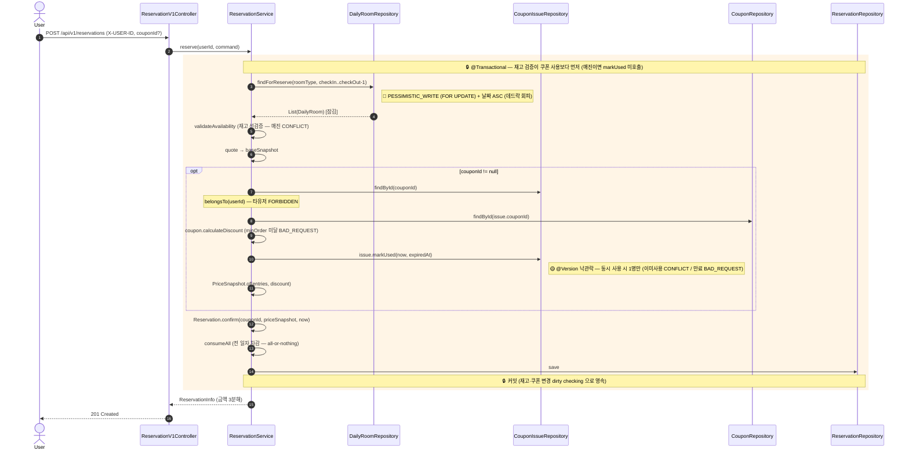
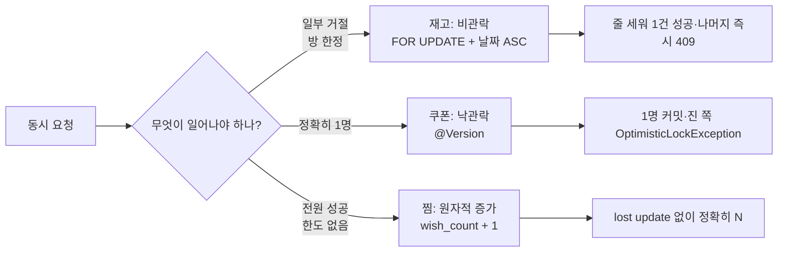

## 📌 Summary

- **배경**: Round 4 발제 — 예약 시 일자별 재고 / 쿠폰 / 결제 금액의 정합성을 트랜잭션으로 보장하고 **더블부킹 등 동시성 이슈를 제어**. 정액/정률 쿠폰 도메인 신설 후 예약에 할인 적용.
- **목표**: ① **"동시 요청들에게 무엇이 일어나야 하는가"** 를 기준으로 한 **구간별 차등 락** (단일 락 통일 X) ② 쿠폰 2 Aggregate + 예약 적용 (단일 트랜잭션 정합) ③ 대고객·어드민 API + 인증 게이트
- **결과**: 도메인 L1/L2 **229건** + apps L1/L2 **86건** 통과 (실패 0). 동시성 L3 (CC-01/08/09) + E2E L4 작성 (Docker 차단). **ADR-004 신설** + 카탈로그 84건.

> 선행 PR #1/#2/#3 미머지 상태라 본 PR diff 에 해당 커밋 포함 (base=main 동일 패턴). **round-4 고유 변경은 `b6a3a39..` 15 커밋.**

## 🧭 Context & Decision

### 문제 정의

- 단순 `@Transactional` 만으로는 막을 수 없는 정합성(Lost Update / 더블부킹)을 락으로 제어. 발제도 "각 도메인 특성에 맞는 전략 선택" 을 명시.
- 핵심 판단은 단일 락 통일이 아니라 **구간 특성에 맞춘 차등 전략** — "동시 요청에게 무엇이 일어나야 하는가" 가 구간마다 다름.
- 진행 방식: TDD Red → **테스트 작성과 분리된 에이전트 Green** → Refactor (round-3 패턴 유지). 카탈로그 ID 를 `@DisplayName` 에 노출.

### 정책 결정 (Q1~Q7 — 로컬 `docs/round-4/03-questions.md`, 미푸시 방침)

| Q | 주제 | 결정 |
|---|---|---|
| **Q1** | 재고 동시성 | **비관락** `FOR UPDATE` + 날짜 ASC (데드락 회피) — 고경합·합성작업·"일부 반드시 거절" |
| **Q2** | 쿠폰 단일사용 | **낙관락** `@Version` — 저경합(1유저 소유)·단일 전이·"정확히 1명만 성공" |
| **Q3** | 찜 동시성 | **원자적 증가** `wish_count + 1` + 복합 PK 유니크 — "전원 성공"·신규 INSERT 는 행 락으로 못 막음 |
| **Q4** | 예약 상태 | 즉시 CONFIRMED 유지 (PENDING 미도입 — 결제 라운드로. 동기 적용이라 비동기 공백 없음) |
| **Q5** | Coupon 경계 | **2 Aggregate** (Coupon 템플릿 / CouponIssue 발급분, ID 참조) + `calculateDiscount` 도메인 메서드 |
| **Q6** | 어드민 | stay-api 내 `/api-admin/v1` 경로 분리 + 헤더 스텁 인터셉터 (LDAP 실연동은 과투자) |
| Q7 | 발제 로컬화 | `docs/curriculum/` gitignore (저작권·공개범위 — 발제 원문 미공개) |

### 핵심 — 구간별 차등 락 (ADR-004)

| 구간 | 동시 요청 결과 | 전략 | 도구 |
|---|---|---|---|
| 재고 | *일부 거절* (방 한정) | 비관락 | `@Lock(PESSIMISTIC_WRITE)` + 날짜 ASC |
| 쿠폰 | *정확히 1명* | 낙관락 | `@Version` |
| 찜 | *전원 성공* (한도 없음) | 원자적 증가 | `wish_count = wish_count + 1` |

- **같은 원자적 UPDATE 가 재고엔 부적합**(가격읽기+검사+차감 합성작업)·**찜엔 정답**(순수 상대증가) — 작업 모양에 따라 정반대 판정.
- **데드락 회피**: 다일자 락을 항상 날짜 오름차순으로 획득(인덱스 스캔 순서와 일치 — reserve/cancel 동일).
- 락 어노테이션은 adapter 에만, port 는 의도(`findForReserve`)만 — DIP (rule 19).
- 찜 중복(같은 유저 더블파이어): 신규 INSERT 중복은 행 락으로 못 막으므로 `wishlist` 복합 PK 유니크가 차단 (rule 10 — 앱 선검사 + DB 제약 2층).

### 정합성 정밀화 (정책 게이트 C-1~C-7 → Red 직전 확정)

- 쿠폰 만료 거절은 `calculateDiscount` 가 아니라 `CouponIssue.markUsed` 책임 (소유·시점 책임 분리). `EXPIRED` 는 저장 안 함 — `now > expiredAt` 파생.
- `markUsed` 가드 순서: 이미사용(`CONFLICT`) → 만료(`BAD_REQUEST`) → 전이 (가드가 변이보다 먼저 — 최초 usedAt 보존).

### 추후 개선 여지

- `OptimisticLockingFailureException` → 409 advice 매핑 (현재 도메인 `CONFLICT` 만 매핑).
- L3/L4 (동시성·E2E) 실행 검증 — Docker Desktop 29.x ↔ Testcontainers 비호환 해소 시.
- 어드민 Property/RoomType CRUD, 결제·예약 PENDING 2단계 — 범위 밖 / 다음 라운드.

## 🏗️ Implementation Overview

### 커밋 구성 (레이어 의존 방향 순 — 각 시점 컴파일·회귀 통과)

| 커밋 | 레이어 | 내용 |
|---|---|---|
| `6c5327d` | 문서 | Phase 0 — **ADR-004** + LLD(class/ERD) 확장 + tdd-plan 카탈로그 84건 |
| `c89e8d0` | 도메인 | `Coupon.calculateDiscount` (FIXED/RATE/끝전내림/minOrder) — CPN-01~11 |
| `6b0064b` | 도메인 | `CouponIssue` (단일사용·`@Version`·만료파생) — CIS-01~13 |
| `cb1a356` | 도메인 | `PriceSnapshot` 3분해 + `Reservation.couponId` — RSV2 (기존 회귀 보존) |
| `d2d2779`·`35338f6` | application | `CouponService` (발급·내쿠폰 상태파생) — CSVC |
| `f7c56f0` | application | `reserve` 쿠폰 적용 통합 (단일 트랜잭션) — RSVC2-01~10 |
| `4e110c1` | infra/동시성 | **재고 비관락** `findForReserve` — CC-01 |
| `d53780f` | infra/동시성 | **쿠폰 낙관락** JPA 어댑터 — CC-08 |
| `e5e8ecc` | infra/동시성 | **찜 원자증가** `wish_count±1` — CC-09 |
| `94e7e1f` | interfaces | 쿠폰 고객 API (발급·내쿠폰) + 예약 couponId·금액분해 |
| `ddc3ce7` | interfaces | 어드민 쿠폰 CRUD + `LdapAuthInterceptor` + `UNAUTHORIZED` |

### 발제 체크리스트 정렬 (4/4 분류 충족)

| 발제 체크리스트 | 충족 위치 |
|---|---|
| 🗞 Coupon (소유·이미사용 불가, 정액/정률, 최대 1회) | `CouponIssue.markUsed`·`belongsTo` + `Coupon.calculateDiscount` (CPN·CIS) |
| 🧾 예약 (원자성, 쿠폰/재고 실패 시 실패·롤백, 성공 반영) | `ReservationService.reserve` 단일 트랜잭션 (RSVC2-01~10) |
| 🧪 동시성 (찜 정상, 쿠폰 1회, 더블부킹 0, 다일자 정합) | CC-01(재고)·CC-08(쿠폰)·CC-09(찜) + ADR-004 |
| 🏷 어드민 (CRUD·발급내역, ldap_required) | `/api-admin/v1/coupons` + `LdapAuthInterceptor` (ADM-01~08, LDAP-01~03) |

### 동시성 전략 구현 현황

| 구간 | 구현 (port → adapter) | 테스트 |
|---|---|---|
| 재고 비관락 | `findForReserve` → `@Lock(PESSIMISTIC_WRITE)` + JPQL `ORDER BY date ASC` (예약/취소만, 읽기 경로 비잠금) | CC-01 (10스레드 → 1건만) |
| 쿠폰 낙관락 | `CouponIssue.@Version` → JPA dirty checking 충돌 → `OptimisticLockException` | CC-08 (동시 사용 → 1회 USED) |
| 찜 원자증가 | `incrementWishCount` → `@Modifying UPDATE wish_count = wish_count + 1` | CC-09 (10명 찜 → 정확히 10) |

## 🔁 Flow Diagram

### 예약 쿠폰 적용 시퀀스 (재고 비관락 + 쿠폰 낙관락 공존, 순서가 핵심)

### 동시성 — 구간별 전략 (같은 자원, 다른 결과)

## 검증 상태

### 테스트 — 4등급 분리 실행 (rule 17 `-DtestTag`)

| 등급 | 케이스 | 상태 |
|---|---|---|
| L1 Pure Unit | 도메인 (CPN·CIS·RSV2 등) | ✅ `-DtestTag=unit` 통과 |
| L2 Slow Unit (Fake) | 도메인 229 + apps 86 (CSVC·RSVC2·ADM·LDAP 등) | ✅ `-DtestTag=slow-unit` 통과, 실패 0 |
| L3 Integration (동시성) | CC-01(더블부킹)·CC-08(쿠폰)·CC-09(찜) + 영속 | ⚠️ 작성·컴파일 완료 — Docker 비호환 환경 차단 (코드 회귀 아님, rule 14 분류) |
| L4 E2E | 컨트롤러 | ⚠️ 동일 |

### 빌드·정합성

- ✅ `./gradlew :apps:stay-api:test -DtestTag="unit | slow-unit"` + `ktlintCheck` (양 모듈) 통과.
- ✅ 잔재 검색 (rule 01) **0건** — 어드민 LDAP 헤더는 rule 01(loopers 흔적 0, grep 게이트) 준수 위해 `X-Loopers-Ldap` → `X-Stay-Ldap`.
- ✅ 카탈로그 ID ↔ `@DisplayName` 역추적성 / Bean Validation 0건 (rule 06) / 도메인 → infra 단방향 의존 (DIP).
- ✅ 기존 회귀 보존 — RSV2 가 PS-/RSV-, B.5c 가 WSVC-, B.4 가 RSVC- 를 무변경 통과로 증명.

### 인증

- `LdapAuthInterceptor` — `/api-admin/**` 진입 전 `X-Stay-Ldap` 헤더 존재 검증, 없으면 `CoreException(UNAUTHORIZED)` → advice 가 401 매핑. 실 LDAP 연동은 미도입(스텁 — Round 4 핵심에서 벗어나 과투자).

---

🤖 Generated with [Claude Code](https://claude.com/claude-code)
